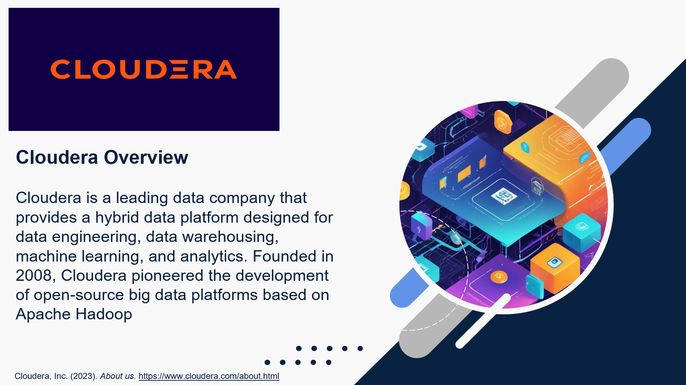
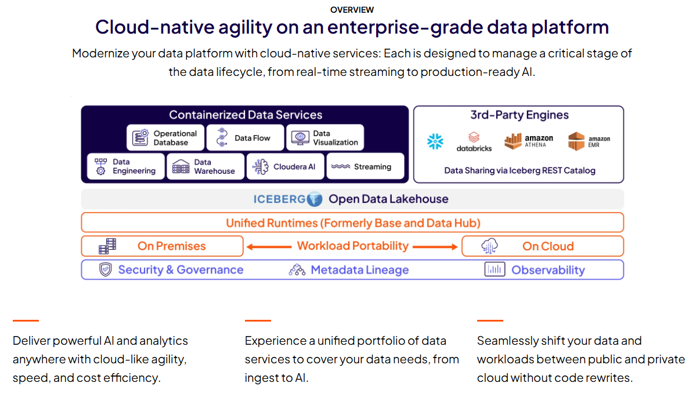
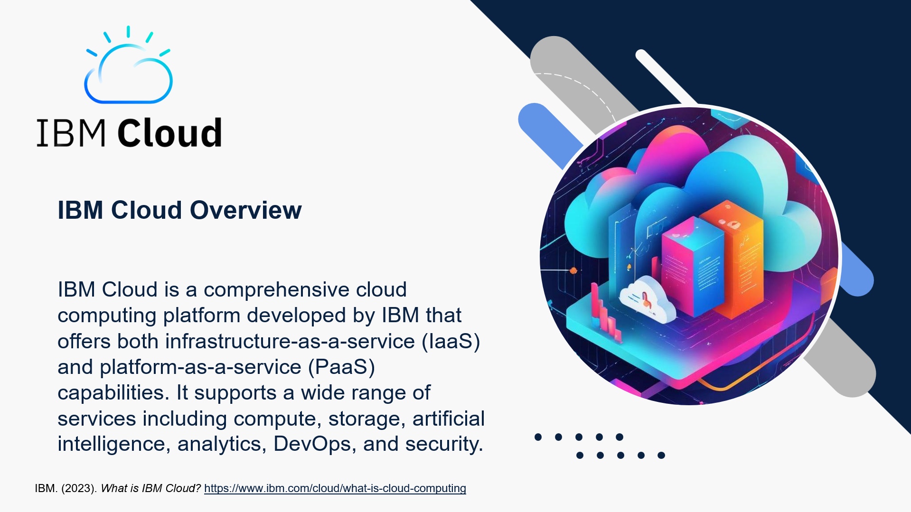
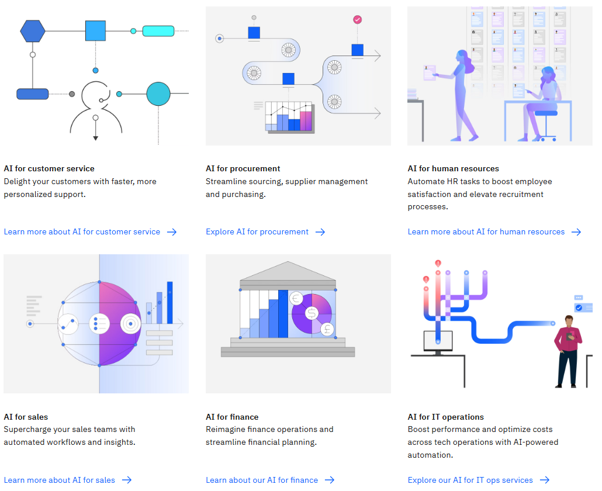
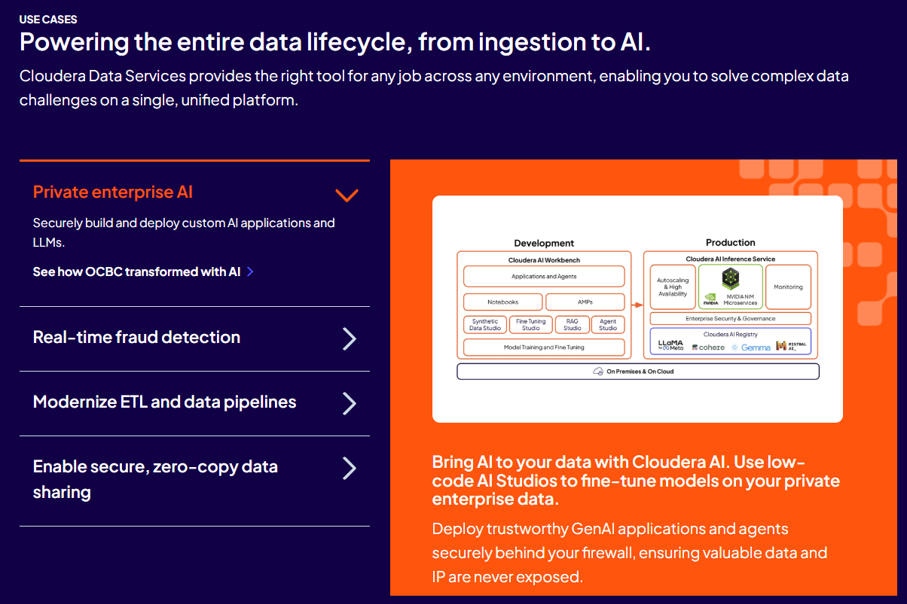
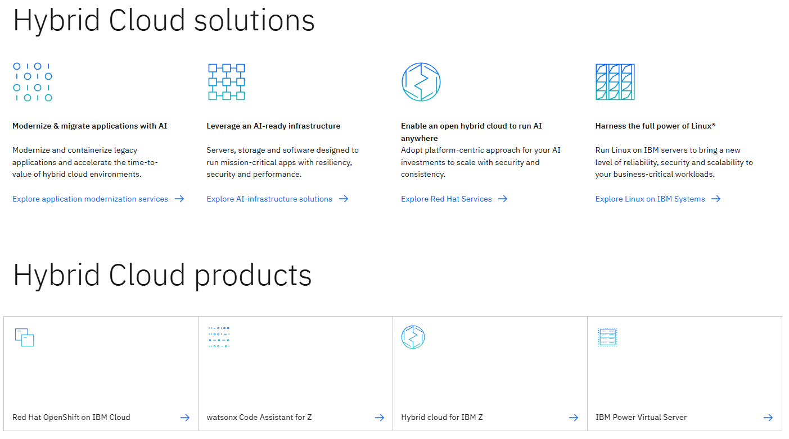

# 📊 Enterprise Data Platform Comparison  
## Cloudera Data Platform vs IBM Cloud Pak for Data  


---

## 🎓 Academic & Research Badges  


---

## 🏫 Academic Context
  - **University:** Fachhochschule Südwestfalen (South Westphalia University of Applied Sciences)
  - **Program:** M.Sc. Informatics & Business (Informatik und Wirtschaft)
  - **Course:** Data Science Project Seminar – Driving Corporate Performance
  - **Semester:** Summer Semester 2025
  - **Student:** Md Abdullah Al Noman Mridha  
  - **Matriculation Number:** 30494592  
This repository presents a comprehensive academic research project comparing two enterprise data platform solutions used in modern data engineering, analytics, and AI workflows.
---

## 📌 Project Overview

Enterprises need robust solutions to manage, analyze, and secure large-scale data across hybrid and multi-cloud environments. This research compares:

  - **Cloudera Data Platform (CDP)** – a hybrid, open, multi-cloud data platform  
  - **IBM Cloud Pak for Data** – a unified data & AI platform built on Red Hat OpenShift  

The objective is to evaluate strengths, weaknesses, architecture, governance, AI/ML support, and ideal enterprise use cases. 

---

## 🗂️ Table of Contents

| Section | Description |
|---------|-------------|
| 📁 [Platform Analysis – Cloudera](research/analysis/cloudera_analysis.md) | CDP architecture, governance, use cases |
| 📁 [Platform Analysis – IBM Cloud](research/analysis/ibm_cloud_analysis.md) | Cloud Pak for Data features and AI focus |
| 📁 [Comparative Analysis](research/analysis/comparative_analysis.md) | Side-by-side evaluation |
| 📁 [References](research/references/references.md) | Official sources & documentation |
| 📁 [Architecture Diagrams](assets/architecture_diagrams/README.md) | Architecture visuals |
| 📁 [Comparison Charts](assets/comparison_charts/README.md) | Visual comparisons |
| 📁 [Methodology](docs/methodology.md) | Research & evaluation method |
| 📁 [Final Project Report](docs/README.md) | Full academic summary |

---

## 🎯 Research Objectives

- Analyze core architectures of Cloudera and IBM Cloud
- Compare data engineering and analytics capabilities
- Evaluate AI/ML integration approaches
- Assess hybrid cloud and scalability strategies
- Review security, governance, and compliance features
- Identify ideal enterprise use cases for each platform

---

## 🧠 Platform Architectures Overview

### 🔹 Cloudera
Cloudera supports hybrid and multi-cloud deployment with separation of compute and storage. It includes:  
- Originated from the Hadoop ecosystem (Founded in 2008)
- Cloudera Data Platform (CDP) supports hybrid & multi-cloud
- Strong focus on:
  - Data engineering
  - Data warehousing
  - Machine learning
- Key features:
  - Shared Data Experience (SDX)
  - Centralized governance & security
  - Scalable analytics pipelines

🔗 Official Website: https://de.cloudera.com/  
  

*Source: Cloudera CDP official documentation*

---

### 🔹 IBM Cloud Pak for Data Architecture  
IBM Cloud Pak for Data runs on Red Hat OpenShift and focuses on:  
- Enterprise-focused cloud platform (IaaS & PaaS)
- Strong AI integration via **IBM Watson**
- Hybrid cloud leadership through **Red Hat OpenShift**
- Key offerings:
  - IBM Cloud Pak for Data
  - AI-driven analytics
  - Enterprise-grade compliance & security

🔗 Official Website: https://www.ibm.com/de-de  
    

*Based on IBM Cloud Pak for Data official docs*

---

## 📊 Comparative Analysis Summary

| Criteria | Cloudera | IBM Cloud |
|-------|---------|----------|
| Core Strength | Data Engineering & Analytics | AI & Enterprise Integration |
| Deployment | Hybrid & Multi-cloud | Hybrid Cloud (OpenShift) |
| AI/ML Tools | CML, ML Pipelines | Watson, AutoAI |
| Governance | SDX Framework | Enterprise Governance |
| Ideal Users | Data Engineers, Analysts | Large Enterprises, AI Teams |

---

## 📊 Feature Comparison

| Feature | Cloudera CDP | IBM Cloud Pak for Data |
|----------|--------------|------------------------|
| Hybrid Cloud Support | ✔ Excellent | ✔ Excellent |
| AI/ML Integration | ✔ Good | ✔ Very Strong |
| Data Governance | SDX | Knowledge Catalog |
| Managed Services | Moderate | Excellent |
| Ideal Use Cases | Data Engineering, Lakes | AI/ML & Managed Analytics |

---

## 🔍 Methodology

This research followed a structured academic research methodology:

1. **Literature Review:** Official vendor docs & whitepapers  
2. **Feature Extraction:** Core capabilities & differences  
3. **Comparative Analysis:** Side-by-side evaluation  
4. **Reporting:** Summary & recommendations

Find the detailed methodology → `docs/methodology.md`

---

## 📌 Project Insights & Business Value

- **Cloudera CDP** excels in hybrid data lake workflows and governance with SDX. 
- **IBM Cloud Pak for Data** offers stronger AI integration and managed services via OpenShift.   
- The best platform depends on enterprise priorities:  
  - **Open data engineering & analytics pipelines** → Cloudera  
  - **End-to-end AI & governance** → IBM

---

## 📂 Repository Structure

```text
Cloudera-IBM-Cloud-Data-Management-Comparison/
├── research/
│   ├── presentation/        # PPT & PDF files
│   ├── analysis/            # Platform & comparison notes
│   └── references/          # Research sources
├── assets/                  # Diagrams & charts
├── docs/                    # Final report & methodology
└── README.md
```

## 🧪 Skills & Concepts Demonstrated

  ### Research Skills

    - Comparative analysis
    - Technical documentation review
    - Enterprise platform evaluation

  ### Concepts

    - Data engineering architectures
    - Cloud & hybrid cloud systems
    - AI/ML platforms
    - Data governance & compliance

  ### Tools
    - Presentation tools
    - Documentation & reporting
    - Analytical thinking for business decisions

## 📎 Project Artifacts
  - 📊 Presentation slides (PPT & PDF)
  - 📝 Research analysis documents
  - 📚 Reference materials
  - 📄 Final academic report

## Use case of Cloudera & IBM Hybrid Cloud Products Overview  




## ✉️ Contact

💼 LinkedIn: https://www.linkedin.com/in/md-abdullah-al-noman-333aa4155  
📁 GitHub: https://github.com/nomanmridha

---

*This repository demonstrates academic rigor and enterprise-focused analytical skills, showcasing a strong profile for data analytics and data engineering roles.*  
